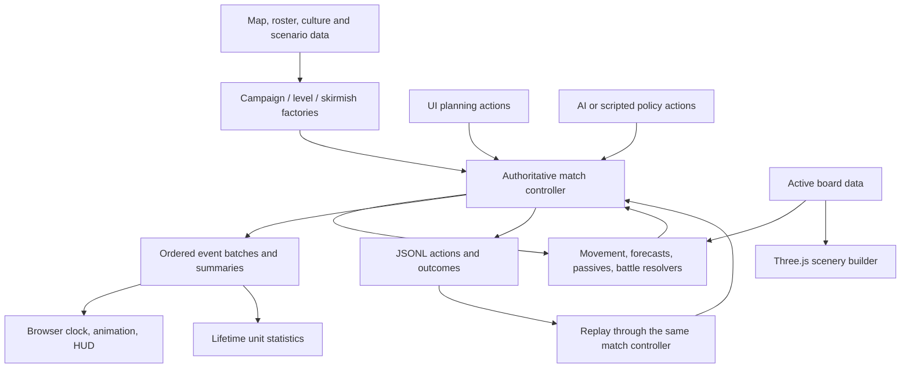

# Project knowledge — Battler

Discovery snapshot: **2026-10-01, main `bec0047`**. Purpose: preserve the game's implemented behavior, architectural boundaries, experiments and mistakes through a framework port. This pass read source, comments, test declarations, Git history/notable diffs, current docs and archived notes. Only this document was written; no gameplay, assets, dependencies, Git index/history or server configuration changed.

Evidence labels matter: **implemented** means present in this revision; **historically verified** means an earlier recorded run; **probe-confirmed** means a small in-memory check during discovery; **inference/risk** means source inspection rather than a failing end-to-end test. No full build/test/browser suite was rerun during this pass. File/line references below are relative to this repository at this revision; later edits will shift line numbers.

## Navigation

1. [Architecture and portability](#architecture-and-portability)
2. [Systems inventory and real formats](#systems-inventory-and-real-formats)
3. [Tuning and implicit rules](#tuning-and-implicit-rules)
4. [Lessons and history](#lessons-and-history)
5. [Current state and open issues](#current-state-and-open-issues)
6. [Port checklist and evidence](#port-checklist-and-evidence)
7. [Source tuning appendix](#source-tuning-appendix)

## Architecture and portability

This is a browser tactics/auto-battler prototype: plain JavaScript ES modules, Three.js rendering, Vite serving/building and Node headless tooling. Dependency ranges are Three.js `^0.170.0` and Vite `^6.0.0`, not a React application (`package.json:5`, `package.json:6`, `package.json:16`). The lockfile, not those ranges, identifies installed versions.

The important extraction already happened in `42c9aa5` (pure board/roster) and `ebafa5f` (shared match controller). **The renderer is not the rules engine.** `createMatch()` owns authoritative records, validates planning actions and produces complete deterministic battle/event batches. Browser and simulator call that same controller (`src/match.js:4`, `src/match.js:70`, `src/match.js:556`, `src/match.js:577`). Rendering consumes the outcome; a port should retain that boundary.



**Framework-independent core:** `board.js`, `terrain.js`, `roster.js`, `rules.js`, `combat.js`, `battle.js`, `timed-battle.js`, `cards.js`, `upgrades.js`, `abilities.js`, `skill-slots.js`, `shards.js`, `passives.js`, `cultures.js`, faction/monster data, `match.js`, statistics and commander logic. They use JS objects, arrays, Maps/Sets and cloning rather than Three.js. Campaign/level factories also use experiment registration, so they are not isolated production content packages yet (`src/campaign.js:10`, `src/levels.js:11`).

**Browser/host-specific adapters:** `log.js` combines a portable collector/replayer with browser fetch/beacon transport; `main.js` and `level-maps.js` use Vite/browser facilities. `src/ui/*.js` mostly return HTML/SVG templates, but their DOM/CSS/data-attribute contracts must be replaced or adapted. `ui.js` combines application coordination with Three.js picking/overlays and needs disentangling for a different UI/renderer.

**Three.js-specific presentation:** `game.js`, `map.js`, `textures.js`, `paint.js`, `painterly.js`, `camera.js`, `units.js`, `models.js`, `sprites.js`, `objects.js`, projected UI plates and geometric overlays. Keep their visual requirements and asset metadata; rewrite their rendering implementation.

**Port hazard: process globals.** Active map, card limits/pool, rarity gate, experiment rules, weapon/class/culture/ability registries and UI feature flags are mutable module-level state. The browser has one match per page, while tests/sweeps repeatedly reset registries. Two simultaneous matches with different maps/cultures in one JS process are not safely isolated today. Moving these into a match/content context is architectural work, not a drop-in renderer change (`src/board.js:12`, `src/cards.js:21`, `src/cards.js:66`, `src/cards.js:72`, `src/match.js:49`, `src/cultures.js:37`, `src/setup.js:49`). Preserve registration and seed ordering while doing it.

## Systems inventory and real formats

### 1. Bootstrap, menu and match configuration

`src/main.js:12` shows the menu when there are no query parameters or `menu=1`; otherwise it preloads painted textures and dynamically imports `game.js`. Dynamic import is deliberate: map painting runs at module setup and must see loaded textures. Failed paint preload falls back to procedural terrain (`src/main.js:19`). A framework port should replace top-level browser side effects with explicit application initialization.

`src/menu.js:31` builds faction/skirmish/mission selection. Setup registers content before creating a match and before building the scene (`src/setup.js:49`, `src/game.js:59`). `faction` means Blue/Red allegiance inside the engine; the player's thematic faction is called `culture`.

Actual selections (`src/setup.js:19`): `classic`, `crown`, `fang`, `league`, `court`. Campaign URLs are built by `campaignURL()` (`src/campaign.js:21`). A real construction example exercised during this pass:

```js
createCampaignMatch(CAMPAIGN_LEVELS[0], {
  faction: 'crown', seed: 7, abilities: false, spells: false,
  combat: { duration: 18 }, log: memoryLog().push
});
```

Browser normal play uses continuous combat, skills/spells off. `skills=1`, `spells=1`, `combat=classic`, `seed`, `speed`, `red`, `blue`/`auto`, `campaign`, `level`, `you` and `foe` are parsed in `src/game.js:64`. Pure `createMatch()` defaults to discrete combat and `spells = abilities` when omitted (`src/match.js:70`). **Faction skirmish flag forwarding currently differs from this intended contract; see open issues.** Same-culture nonclassic skirmishes are refused because mirror champion identities are not generalized (`src/setup.js:86`); the browser substitutes Classic for an identical foe (`src/game.js:86`).

### 2. Map content, grid helper and board registry

Map files are **JavaScript data modules, not serialized editor files**. Format: `{id, name?, layout: string[], hills: [column,row][]}`. Row zero is north; columns increase east. `G/F/M/W/R/B/V/C/K` mean plains/forest/mountain/river/road/bridge/village/Blue keep/Red keep. `parseLayout()` enforces equal row widths and known letters (`src/terrain.js:28`). It does not provide a full authored-map validator for required keeps, hills, connectivity or campaign spawn capacity.

Real complete map from `src/maps/river_ford.js:6`:

```js
{
  id: 'river_ford', name: 'The River Ford',
  layout: [
    'MMMFGGGWGGGFFMMM', 'MMFFGGGWGGRRKGMM',
    'MFFGGVGWGGRGGGFM', 'FFGGGGGWWGRGFFFM',
    'FGGGFFGGWGRGGVFF', 'GGRRRRRRBRRGGGFF',
    'GGRGFFGGWGGGFFGG', 'FGRGGGGWWGGMMGGF',
    'FGRGVGGWGGGMMMGF', 'MGRRGGWWGGFFGGFM',
    'MMCRGGWGGFFFGGMM', 'MMMGGFWGGFFGMMMM'
  ],
  hills: [[1,2],[2,2],[1,3],[2,1],[10,9],[11,9],[9,10],[10,10],[11,10]]
}
```

`setMap()` parses and replaces live `MAP/LAYOUT/W/H` bindings; movement, forecasts, deployment and renderer all read those bindings (`src/board.js:18`). Terrain definitions combine mechanical bonuses with presentation metadata (`src/terrain.js:12`): for example `F: {name:'Forest',def:1,avo:20,h:0.22,ground:'forest',props:'trees'}`. Split those concerns carefully in a port without changing bonuses.

The **map creator** currently consists of authored ASCII maps, experiment paint functions and the visual builder. `experiments/maps/_grid.js:5` generates a fixed 16×12 plains grid with configurable `paint(c,r)` and villages, then stamps keeps. `forest_belt`, `choke_gap1/3`, `hamlets`, `ridge_line`, `village_chain` and other fixtures use it. This is useful deterministic code-based authoring, not a visual editor, tileset brush or general seeded playable-level procgen. Browser experiment-map discovery uses `import.meta.glob`; Node explicitly registers maps (`src/level-maps.js:4`, `src/levels.js:27`). Replace that build-time loader when leaving Vite.

Three authored campaign maps are 12×18 and stored as data in `src/maps/campaign.js:2`. Their map IDs are `campaign-road`, `campaign-woodland`, `campaign-crossing`, while mission IDs are `road`, `woods`, `pass`; do not conflate them.

### 3. Scenery builder, terrain painting and environmental animation

`buildMap(scene)` consumes the active board and constructs meshes, painted atlases, props, water, buildings, grass and flags (`src/map.js:1153`). Logical tile `(c,r)` becomes centered world `(c-(W-1)/2,0,r-(H-1)/2)` (`src/map.js:18`). This mapping is an adapter; terrain height is not a movement cost calculation.

A continuous subdivided land surface replaces individual block steps, with shared vertices/normals and gorge walls that follow the same displaced river contour. Heights: level step 0.3, plains top 0.52, water Y 0.16, eight subdivisions per tile (`src/map.js:24`, `src/map.js:28`, `src/map.js:29`, `src/map.js:1091`). `tileTop()` gives units/overlays their support height; bridge tiles stand at land-deck height (`src/map.js:45`). Hills are presentation metadata; only terrain letters affect rules.

`terrainAtlas()` paints ground classes, roads, yards, fields and paving into canvas textures (`src/textures.js:545`, `src/map.js:1106`). `riverTextures()` builds water/foam maps (`src/textures.js:646`). Visual randomness uses independent fixed seeds, including `rng(7)` in `buildMap`, atlas seed 12 and river seed 5; match seed changes dice/cards, not a generated level layout (`src/map.js:1154`, `src/map.js:1106`, `src/map.js:1235`).

Static meshes are grouped by material/shadow state and merged (`src/map.js:493`); foliage uses vertex colors so a forest can batch rather than giving every tree a material (`src/map.js:106`). Grass/wheat use instancing and shader wind; flags and water animate through `map.animate(t)` (`src/map.js:523`, `src/map.js:697`, `src/map.js:1261`). Occlusion caps limit prop height to keep units visible (`src/map.js:175`). Some decorative values are still tied to River Ford, notably the fixed island coordinates (`src/map.js:1041`); waterfall rendering is explicitly River-Ford-only (`src/map.js:1258`). Reuse content concepts in a port, not unexamined coordinates on every new board.

Paint detail maps are derived from CC0 watercolor sources, normalized around 0.5 gray and soft-light blended rather than replacing terrain colors (`tools/assets/prep_terrain_textures.py:1`, `src/textures.js:407`). Real prep tuning is 512 px, target luminance std 0.085, gain cap 5 (`tools/assets/prep_terrain_textures.py:19`). `loadPaint()` provides grass/dirt/stone/water sets and treats absent images as optional (`src/paint.js:7`, `src/paint.js:13`, `src/paint.js:25`). This canvas/material implementation is browser/Three.js-specific; source textures and intended blending are portable.

### 4. Unit records, identities, factions and categories

`roster.js` owns templates, starting forces, variant overlays, champions and constructors (`src/roster.js:8`, `src/roster.js:34`, `src/roster.js:56`). A unit is plain data: identity/class/culture/side; grid coordinates; HP/maxHP; STR/MAG/SKL/SPD/DEF/RES/MOV; weapon; level; appearance; stars/population; energy/cooldowns/statuses; stance/objective/facing; selected abilities/slots; optional passives/death hook. Never substitute a render object's identity for the unit record.

Real base template (`src/roster.js:9`):

```js
pikeman: {
  name:'Pikeman', title:'Recruit', lv:2, hp:24, str:8, mag:0,
  skl:5, spd:4, def:9, res:1, mov:4, weapon:'Iron Pike'
}
```

`createRecruitUnit('crownGuard',id,side,c,r)` can yield `cls:'pikeman'` but `variantId:'crownGuard'`. `variantOver()` starts from the base, applies explicit stat overrides and deltas, then carries culture/passives/death data (`src/roster.js:18`). `cls`, `classId`, `variantId`, `unitId`, champion `id` and `spriteKey` serve different purposes; collapsing them broke reserves, rarity, art and kit scoping historically.

`registerCulture(def)` installs real classes, variants, champion templates, weapons, movement types, category metadata, ability/spell/card entries and pools, recording what to unregister (`src/cultures.js:40`). Real variant schema is demonstrated by Crown Guard: base Pikeman, delta `{hp:2,def:1,mov:-1}`, Hold default, Shieldwall passive, cost 2 (`src/factions/argent-crown.js:24`, `src/factions/argent-crown.js:77`). Culture data may contain **functions** for ability effects/builders, so it is not all JSON-serializable content (`src/abilities.js:97`, `src/factions/white-fang.js:97`). A port to a different language needs an explicit effect vocabulary/interpreter, not naive JSON export.

Categories are melee/ranged/mounted/caster/support. They inform display and AI preferences, not combat behavior by themselves; magical damage comes from the weapon's `magic` flag (`src/categories.js:1`, `src/categories.js:12`, `src/combat.js:31`). `prepareFactions()` resets registrations, registers selected cultures, and applies uncommon/rare gates at rounds 3/6 (`src/setup.js:15`, `src/setup.js:49`). Campaign registers player and three rival cultures; scenario levels disable rarity gating for their injected cards (`src/campaign.js:37`, `src/levels.js:127`).

### 5. Movement, range and orders

`computeRange(unit,board,mov,options)` runs a cost-sorted search over four cardinal neighbors, returns reachable tiles, attack overlay tiles, legal target stand positions and `pathTo(c,r)` (`src/rules.js:19`). Its board adapter uses `{list:[{data:unit}],unitAt,byId}` rather than requiring scene objects (`src/match.js:197`). Foot forest/mountain costs are 2/3; armored units cannot enter mountains; mounted forest costs 3. River is omitted from every movement-cost table and is impassable; bridges cost 1 (`src/rules.js:5`).

Range is Manhattan distance, including minimum range: Longbow `[2,2]` cannot shoot adjacent units. There is no explicit line-of-sight/raycast obstacle check in attack eligibility (`src/rules.js:44`, `src/combat.js:30`). UI threat overlays and AI reuse the rules, but an overlay is not a promise that every simultaneous move will be accepted.

One planning move per unit uses full MOV, preserves the returned path and updates facing from its last segment (`src/match.js:354`). Stances are Advance/Hold/Protect; Protect requires a living friendly subject other than self. Advance can carry a tile objective (`src/match.js:364`). Discrete automatic Advance uses rounded two-thirds MOV with minimum 1; Hold zero; Protect full MOV (`src/abilities.js:28`). Timed pursuit chooses adjacent steps using legal full-range search and blocks allied transit tiles (`src/match.js:694`, `src/match.js:785`). Protect whose subject dies falls back to class default (`src/match.js:688`). No general player tile-order editor is complete even though engine tile objectives exist.

### 6. Authoritative match lifecycle, territory and deployment

`createMatch()` builds units, sides, independently seeded card streams, territory, queues, objects, statistics and optional campaign/timed state (`src/match.js:70`). Blue and Red are fixed sides. Territories are keyed by `"c,r"`; keeps start owned, villages neutral (`src/match.js:87`). Public actions return `{ok:true,...}` or `{ok:false,reason}` and all attempted actions are logged, including failures (`src/match.js:556`). Framework-agnostic logic; its globals are the main isolation constraint.

Real action and result from the discovery's Crown/Road seed-7 probe:

```json
{"t":"action","round":1,"actor":"human","action":{"type":"campaignOrder","faction":"blue"},"ok":true,"result":{"tile":[5,11]}}
```

Normal deployments are on owned keeps/villages or their Manhattan-radius-1 neighbors, require free traversable tiles and cost no extra Supply after recruitment (`src/match.js:207`, `src/match.js:221`, `src/cards.js:173`). Withdrawal is for living nonchampions in a controlled deployment area with reserve space (`src/match.js:230`). Population counts **field plus bench**, including champions and star-tier costs (`src/match.js:202`). Changing population caps therefore changes reserve purchasing too.

Round order is Pearl regen; queued spells Blue then Red; defense/skill setup; movement/passives/attacks; final deaths/revenants/objects/captures/end checks; if continuing, object decay, increment round, draws/income, reserve recovery, energy/cooldowns and respawn (`src/match.js:577`, `src/match.js:822`, `src/match.js:880`). In timed mode skill phases occur at windows within the simulation; captures/waves/respawn remain boundaries, not subsecond events.

Villages change owner when occupied at round end (`src/match.js:857`), without a separate capture button. Skirmish victory is standing on the opposing keep or eliminating all field units/reserves/pending champion; keep checks precede annihilation and iterate Blue first (`src/match.js:949`). A pending but unaffordable respawn can prevent annihilation victory; a maximum-round cap is an independent draw safeguard (`src/match.js:920`). This ordering is gameplay, not merely implementation detail.

### 7. Combat forecast and simultaneous resolution

`src/combat.js:26` is the reusable stat forecast. Physical power is STR + weapon might; magic uses MAG. Subtract DEF or RES and terrain DEF. The sword → axe → lance → sword triangle adds ±1 power and ±15 hit; neutral weapons bypass it (`src/combat.js:19`). Hit is weapon hit + 2×SKL − 2×target SPD − terrain avoidance + triangle, rounded and clamped 0–100; crit is weapon crit + SKL/2 − target SKL/4, also rounded and clamped 0–100 (`src/combat.js:26`). Forecast doubling needs a speed advantage of 4 (`src/combat.js:39`). **That doubling belongs to legacy duel resolution, not the timed attack scheduler.** `resolveCombat` at `src/combat.js:63` retains counterattacks/follow-ups; the current automatic battle instead uses `src/battle.js:65`.

Automatic combat snapshots units, resolves contested moves, then aggregates strikes before changing HP. Occupied starting tiles cannot be entered merely because their occupant also moves; swaps are disallowed. Contention is seeded, with stable ID tie-breaking (`src/battle.js:86`, `src/battle.js:132`). Each eligible unit makes at most one strike in that resolution (`src/battle.js:159`). Targets must be in weapon range; explicit legal targets win, then nearest enemies with deterministic ordering. Real enemies take priority over destructible objects (`src/battle.js:257`). There is no line-of-sight raycast.

Attack modifiers include abilities, passives, ignore-defense, and cavalier facing/flank bonuses. Crit multiplies by 3. Timed damage scales **after** flat mitigation; discrete combat scales before it (`src/battle.js:180`, `src/battle.js:187`). Ward halves damage; Brace and Barrier are finite pools allocated against incoming hits sorted by damage, then attacker ID (`src/battle.js:199`). Thorns retaliates on adjacent damaging hits, through simultaneous damage aggregation (`src/battle.js:212`). Strike events may report overkill damage although HP is clamped to zero (`src/battle.js:218`). This distinction matters to statistics and future kill rewards.

Real strike event from the discovery probe:

```json
{"type":"strike","flank":null,"flankBonus":0,"attackBonus":0,"attackerId":"pike_b1","targetId":"enc-0-0-0","hit":true,"crit":false,"damage":5,"warded":false,"barrierAmount":0,"barrierReduction":0,"braceReduction":0}
```

The combat, targeting and event records are framework independent. Renderer raycasts are selection only; they must not become the authority for combat range or damage.

### 8. Continuous combat clock

`src/timed-battle.js:18` is a pure simulation, computed before animation. Defaults (`src/timed-battle.js:4`) are 18 seconds, a fixed 0.25-second tick, skill windows at 3/9/15 seconds, damage scale 0.35, movement interval 0.8 seconds, attack base 2.8 seconds and speed coefficient 0.12. Attack interval is `clamp(attackBase - speedFactor * (SPD - 4) + classDelay, 1.2, 3.5)` (`src/timed-battle.js:5`, `src/timed-battle.js:6`). Explicit unit attack intervals are also clamped. Initial attack readiness is 0.75 seconds (`src/timed-battle.js:23`).

Every tick performs a skill window if due, movement, fresh positional passives, and ready attacks; deaths can terminate the phase early (`src/timed-battle.js:29`). Cooldowns remain round-based. A 0.8-second movement interval effectively becomes 1 second on the 0.25-second grid (`src/timed-battle.js:57`). An attacker with no legal target retains readiness. Optional acceleration can lower intervals to 0.7 seconds (`src/timed-battle.js:60`). Transient status is cleaned up at the end (`src/timed-battle.js:73`).

The seed for each tick derives from the phase seed and step (`src/timed-battle.js:42`). Playback speed, frame rate and hidden-tab pauses do not influence the simulated result. Config accepts duration 1–60 seconds and sorts/deduplicates skill times (`src/timed-battle.js:12`). **Source-inferred configuration hazard:** non-grid skill times pass validation but the exact-time membership test at `src/timed-battle.js:32` never reaches them. Default 3/9/15 windows are safe.

### 9. Archived abilities, skill slots and spells

Abilities and spells remain implemented, but normal gameplay disables both. `?skills=1` and `?spells=1` restore them in the browser (`src/game.js:65`); the skirmish forwarding defect is described below. The global ability switch defaults false (`src/abilities.js:5`). These are archived systems, not safe-to-delete dead code.

A unit type has three ordered slots. Explicit arrays are preserved; defaults sort defense, enhancement, recovery (`src/skill-slots.js:2`). Validation requires exactly three entries, legal kit IDs, and no duplicates; dropping an existing skill moves it rather than duplicating it (`src/skill-slots.js:9`, `src/skill-slots.js:17`). Type identity is variant ID, then unit ID, then class (`src/match.js:74`). Updates propagate to field units, bench units and subsequent recruits (`src/match.js:76`, `src/match.js:378`). Example shape: `["brace","focusedShot",null]` is a slot-format illustration; legality depends on that type's kit.

Energy caps at 4; field recovery is +1 per round and reserve recovery has an additional +1 (`src/abilities.js:2`). Skill windows add energy only when abilities are enabled (`src/match.js:794`). A scheduled slot gets its window attempt; successful skills are tracked to avoid duplicate firing (`src/match.js:629`). Classic selection validates the whole paid bundle, so Rally cannot finance a bundle that was initially unaffordable (`src/abilities.js:60`, `src/abilities.js:67`). Slot selection instead allows a plan that cannot yet be afforded (`src/match.js:386`).

Base abilities (`src/abilities.js:7`) include Rally (cost 0, cooldown 2, heal 10 and energy recovery), Brace (2/2, absorb 4), Focused Shot (2/2, +4 damage/+20 hit), Charge (2/2, +4 damage when advancing and moved into melee), and Second Wind (1/3, heal 6 at half HP or below). Culture registration scopes abilities to their culture (`src/cultures.js:83`). Many culture effects use functions, so copying a JSON catalog alone will lose behavior.

Spells are queued in planning and resolved before ordinary attacks (`src/abilities.js:126`, `src/abilities.js:178`). Mend costs 1 and heals 8; Ward costs 1 and halves upcoming damage; Fireburst costs 2 and deals 6 to enemies within Manhattan radius 1 (`src/abilities.js:106`). Legacy equipment uses two slots (`src/abilities.js:189`). Barrier cards are retained for compatibility but are absent from the normal Shards shop (`src/cards.js:39`).

### 10. Economy, cards, recruitment and reserves

`src/cards.js:6` is the economy authority: initial Supply 3, income 3 per round, bank 30, ordinary hand limit 8, opening draw 5, later draw 3, reserve limit 8, population cap 10, and one shared cycle per round. Supply accumulates. If a refund puts Supply above the bank, income pauses rather than confiscating the excess (`src/cards.js:138`). Villages enable deployment; they do not add passive income. There are no enemy-kill Supply/card rewards or purchasable population upgrades yet.

The card RNG is xorshift32 (`src/cards.js:52`), distinct from battle RNG. Recruitment pays once and puts a unit on the bench, enforcing both bench and total population capacity (`src/cards.js:151`). Deployment is free afterward (`src/cards.js:173`). Withdrawal preserves injuries, energy, cooldowns, stars and variant identity (`src/match.js:344`); redeploying is not a heal/reset exploit (`src/match.js:306`).

Bench cycling refunds that recruit's paid cost, frees its population and produces an unpaid replacement card of matching type/rarity/stars (`src/cards.js:211`). Replacement cost scales by `3 ** (stars - 1)` (`src/cards.js:220`). Cycling consumes the same shared per-round allowance as other cycling. **Probe-confirmed bug:** `previewCycle` counts the entire hand including dedicated Shard offers (`src/cards.js:200`). A hand with five ordinary cards and three Shards incorrectly refuses a bench cycle as hand-full. Normal round draws remove Shards first and do not have this particular problem (`src/cards.js:138`).

### 11. Three-unit upgrades

`src/upgrades.js:5` caps stars at 3 and gives population costs 1/2/3 by star. A merge requires three distinct compatible nonchampion units, matching class, variant, faction, rarity and star (`src/upgrades.js:25`, `src/upgrades.js:110`). The player chooses a survivor and legal destination; field survivors still require valid coordinates (`src/match.js:541`).

Each star upgrade adds HP 8, STR 2, MAG 1, SKL 1, SPD 1, DEF 2, RES 1 and MOV 0 (`src/upgrades.js:8`). Paid costs sum. Health becomes the combined health ratio applied to the new maximum; energy takes the minimum and cooldowns the maximum (`src/upgrades.js:60`, `src/upgrades.js:75`). Survivor stance/location survive. This is deliberately not free full healing or multiplicative stat growth. Upgrade previews and execution should share the same pure rules in a port.

### 12. Shards

`src/shards.js:4` sets a 12-item dock, three attached Shards per class and maximum tier III. Eight types (`src/shards.js:13`) have tier I/II/III values: Ruby STR 1/2/4; Sapphire DEF 1/2/4; Emerald max HP 3/6/12; Topaz SPD 1/2/4; Amethyst SKL 2/4/8; Garnet block 1/2/4; Pearl regeneration 2/4/8; Onyx thorns 1/2/4. Tier-I shop cards cost 1 (`src/shards.js:35`). Duplicate effects stack. Three matching ID/tier Shards become one next-tier Shard (`src/shards.js:70`).

Each match deterministically chooses four of the eight types from a seed-mixed shuffled catalog (`src/shards.js:82`). Each round deals 2–3 offers, with replacement, outside the ordinary-card draw budget (`src/cards.js:120`). Old offers expire on refresh. Instances receive unique IDs. Buying moves an offer to the dock; applying attaches it to a class; removal returns it; combination consumes three dock instances (`src/match.js:480`, `src/match.js:502`, `src/match.js:514`, `src/match.js:526`).

Stat synchronization applies the difference between old and new bonuses to field and reserve units (`src/match.js:166`). Emerald increases current HP with max HP for living units but does not revive dead units (`src/match.js:179`). Pearl heals field units before queued spells (`src/match.js:583`); Garnet initializes finite blocking and Onyx supplies retaliation (`src/match.js:669`, `src/match.js:676`). Class attachment must therefore survive recruitment, withdrawal and merging. Pure rules are portable; dock/card DOM is replaceable.

### 13. Campaign and encounter progression

`src/campaign.js:12` defines three missions on south-to-north 12×18 maps: Road, Woodland and Pass. Road starts with single waves; later missions add waves. Seeded encounter faction selection excludes the chosen player faction and classic culture (`src/campaign.js:25`). Encounters mix role-converted foreign faction units and monster aliases (`src/campaign.js:42`). Enemy facing is south, stance Hold. Blue starts with five authored positions (`src/campaign.js:39`).

The three stage checkpoints are `[5,11]`, `[5,6]`, `[5,1]` (`src/campaign.js:40`, `src/campaign.js:42`). The campaign order sends the army north toward the checkpoint (`src/match.js:253`). Enemy deployment searches nearby free traversable positions and throws if none can be found (`src/match.js:112`). Enemies have no shop economy: their opening hand/Supply are cleared, refresh is skipped, and Red campaign actions are rejected (`src/match.js:105`, `src/match.js:557`, `src/match.js:891`).

Clearing a wave spawns the next wave at the round boundary; clearing the last wave enables regrouping (`src/match.js:950`). Rally works once per stage, requires an ally within distance 2 of the checkpoint, and heals nearby units by 4 (`src/match.js:259`). Continuing advances the stage and spawns its enemies (`src/match.js:273`). Final victory requires reaching the north exit, not just killing the last enemy (`src/match.js:960`). Starting the next mission creates a fresh match/army: persistent inventory, injuries and economy across missions are not implemented.

### 14. Monsters, passives and tile objects

`src/monsters.js:9` defines eight enemy-only kits: Rat, Spider, Hyena, Corpse Hound, Werewolf, Moth, Golem and Ogre. Monsters borrow a base stat/weapon envelope but have their own class identity and sprite key (`src/monsters.js:41`). They do not register shop cards or normal player ability kits. Each has a simple passive: adjacent-ally accuracy, stationary accuracy, pack damage, corpse proximity damage, low-HP damage/reduction, Hold reduction, or ignore-defense (`src/monsters.js:10`).

`src/passives.js:28` evaluates conditions and `src/passives.js:48` evaluates Manhattan auras. Low-HP monster tests use strict `< half`, unlike Second Wind's `<= half`; preserve this unless intentionally retuning. Timed combat recomputes positional effects each tick (`src/timed-battle.js:49`). Its struck-energy behavior can occur per damaging tick (`src/timed-battle.js:66`), while some older Grit descriptions say once per battle; this deserves review when skills return.

Tile objects include HP-bearing barricades and nonblocking corpse markers (`src/match.js:135`). Barricades block enemy movement but permit allies to transit, not stop. Attacks prioritize real enemy units over objects. Corpse consumption chooses nearby objects deterministically and is not restricted by corpse owner (`src/match.js:750`). Revenant is once per eligible unit, returns at 1 HP at round end, and excludes champions (`src/match.js:827`). Some design wording suggests once per faction, but code is authoritative. Final eligible deaths leave corpses only if the tile has no object (`src/match.js:847`). Decay advances on continuing-round boundaries, including the spawning round (`src/match.js:880`).

Champions respawn after a two-round delay, paying 1 Supply, at full HP with refreshed state (`src/match.js:929`, `src/roster.js:75`). Kill attribution currently uses the last positive strike/thorns event, not a fully general lethal-source record (`src/match.js:835`). Future rewards must handle spell deaths, overkill, simultaneous trades, objects and revenant returns without duplicate payouts.

### 15. AI planning

`src/ai/commander.js` contains current Greedy/heuristic commanders. These operate through match actions rather than renderer state. They recruit, deploy, choose stance/targets and, where enabled, manage skills and Shards. Campaign enemies are authored encounters and cannot use the recruitment economy even if an AI policy is attached. AI Shard management holds potential triples rather than immediately filling every attachment slot; Greedy does not provide equivalent Shard management. Seed, available Supply, bench space and deployment geometry affect decisions.

`src/ai.js:9` is the older expected-damage/kill/terrain action selector; discovery found no current imports. Retain it as historical logic until its consumers are explicitly checked. Nearest Manhattan targeting and local pursuit are not a full obstacle-aware strategic planner. The Iron League blocked-river target-selection TODO captures this limitation.

### 16. Scenarios, fixtures and experiments

`src/levels.js:18` groups 24 scenarios: seven classic, three Crown, five Fang, five League and four Court. Definitions include map, units, scripts, rules/candidates, starting hand, loadouts, reinforcement and champions. The constructor adapts older loadouts to current systems (`src/levels.js:91`): Barrier becomes a Garnet-II fixture. Initial energy and setup grants can be direct setup mutations (`src/levels.js:134`); replay therefore needs the same scenario factory, not just ordinary action records.

`src/level-maps.js:4` discovers authored experiment map modules with Vite globbing. It skips underscore-prefixed helpers and modules without layouts. These are hand-authored grids, not a general procedural campaign generator or visual tile editor. `experiments/maps/_grid.js:5` supplies simple stamp/paint helpers. The builder creates scenery around layout semantics; it does not design the encounters automatically.

`tools/sim/run.mjs` runs headless matches; `tools/sim/report.mjs`, inspection/matchup/Shards tools and `tools/experiment-skill-timelines.mjs` summarize experiments. Default headless simulation is not automatically browser timed campaign configuration. Side swapping is not map mirroring. `--no-logs` still allows summary outputs, so these scripts were not run during this read-only pass. Tests under `tests/` cover pure mechanics and UI contracts; browser verification scripts produce separate visual evidence. Fixtures that directly grant Shards or set HP are useful coverage, but not proof of natural-income progression.

### 17. Planning interface and deterministic playback

`src/ui.js:224` owns the planning interface. The left army rail groups field and bench units by identity (`src/ui/army.js:2`). Selecting a type exposes stats and, when abilities are enabled, three slots and a card palette (`src/ui.js:598`, `src/ui.js:619`). Skill order is type-wide. The action menu anchors above the selected unit in projected screen space and clears the open side panel (`src/ui.js:633`). Mobile layout changes at 820px (`src/ui.js:598`). `src/ui/shards.js:20` renders the dock and class attachments; DOM data attributes are also verification contracts.

Resolve first computes the authoritative final match, then plays its timeline (`src/ui.js:882`, `src/ui.js:900`). Playback temporarily restores starting positions, sequences animation promises per unit, pauses elapsed time while hidden and finally reconciles visuals (`src/ui.js:972`, `src/ui.js:1011`). Units' view setters also mutate their attached position data (`src/units.js:354`), which explains why rewind/reconciliation must be preserved together. **Do not apply combat damage or count stats again from animation callbacks.** A port should render immutable snapshots/events and keep simulation separate from playback.

Card, reserve, detail and loadout templates live in `src/ui/`; portraits use native artwork when available, otherwise SVG persona/gear rendering (`src/portraits.js:928`). `src/ui/util.js:10` makes SVG IDs unique: duplicate gradients/clip paths caused browser-dependent disappearing art. The sidebar/action overlap fix belongs to layout clearance, not merely z-index.

### 18. Art pipeline, camera and rendering

`src/sprite-art.js:3` imports generated metadata from `src/art/factions-manifest.json`, resolves sprite key → variant → unit ID → class, and respects deployment base URLs. Faction sprite preparation is `tools/assets/prep_faction_sprites.py`; original character preparation is `tools/assets/prep_sprites.py:15`. These crop transparent bounds, establish feet anchors, rescale and generate portraits plus metadata. Source art under `design_assets/` should remain untouched. Generated public assets and module metadata must agree.

A real Rat metadata entry records source `design_assets/factions/monsters/Rat.png`, source size 1536×1024, crop `[22,125,1523,927]`, output 248×138, world height 0.42, anchor approximately `[0.499040895,0.954247658]`, and foot width about 0.219676. Its runtime file is `sprites/factions/monsterRat.png`. This is the format to port, not a guessed center pivot. The manifest has 24 entries; inspect the exact full JSON for all precision and scaling fields. Real record at `src/art/factions-manifest.json:599`:

```json
{
  "file": "sprites/factions/monsterRat.png",
  "portrait": "sprites/factions/monsterRat-portrait.png",
  "portraitCrop": [
    0.6536458333333334,
    0.271484375,
    0.9772135416666666,
    0.7568359375
  ],
  "source": "design_assets/factions/monsters/Rat.png",
  "sourceSize": [
    1536,
    1024
  ],
  "cropBox": [
    22,
    125,
    1523,
    927
  ],
  "size": [
    248,
    138
  ],
  "height": 0.42,
  "visibleHeight": 126,
  "anchor": [
    0.4990408950307315,
    0.9542476582381287
  ],
  "footWidth": 0.21967621419676214,
  "headTop": null,
  "scaleClass": "large",
  "alpha": "source cutout; preserved RGBA transparency; no hue shift"
}
```

`src/sprites.js:103` creates alpha-tested unlit billboard geometry anchored at feet. Texture caching, sRGB handling, mipmaps and anisotropy are at `src/sprites.js:23`. Alpha-mask raycast filtering prevents selecting transparent rectangles (`src/sprites.js:41`, `src/sprites.js:124`). Height compensates for camera tilt (`src/sprites.js:161`). Contact shadows replace sprite-quad shadow casting (`src/sprites.js:132`, `src/sprites.js:142`). Native faction art is not globally recolored. Legacy hue shifting also affected eyes and was superseded by dedicated faction illustrations.

Procedural/GLB fallback models remain in `src/models.js:211` and `src/units.js:322`. Missing faction-specific art intentionally borrows compatible envelopes; this is incomplete art coverage, not missing combat definitions. `docs/art/FACTION_SPRITES.md` records coverage. Blender dimensions and terrain heights must remain coordinated: ground top 0.52 (`src/map.js:28`), horse saddle/crotch/scale anchors (`src/models.js:61`). `CREDITS.md:4` records own Blender environment assets and CC0 watercolor textures. Older research proposals for generation services are not evidence those tools were installed or used.

`src/camera.js:9` defines 40°/52° tilt, distance 30, zoom 0.55–2.6 and drag threshold 8px. It is an orthographic camera with portrait framing and tray insets (`src/camera.js:31`, `src/camera.js:40`). Map width is captured during module initialization (`src/camera.js:18`); current bootstrap constructs the match/map first. Live map changes after camera import would need refitting.

`src/game.js:24` limits drawing to about 1.6 million pixels and never exceeds CSS pixel ratio 1. Renderer antialias is off; shadows use a 2048 map, manually refreshed (`src/game.js:29`, `src/game.js:52`, `src/game.js:185`). The post stack is Render → GTAO → bloom → Painterly → Output → SMAA (`src/game.js:106`). GTAO uses eight samples and hides sprite rectangles during depth/normal capture (`src/game.js:110`, `src/game.js:115`). Painterly uses a depth-aware sprite-preserving mask (`src/painterly.js:95`). Static map geometry merges by material/shadow bucket (`src/map.js:493`); grass uses instancing (`src/map.js:523`).

Idle rendering is capped at 30fps and busy playback at 60fps. Hidden tabs stop the animation loop and reset timing on return (`src/game.js:170`, `src/game.js:200`). Frame delta caps at 0.1 seconds. Performance counters measure submitted work/CPU timing, not hardware GPU utilization. **H toggles the entire composer stack, not shadows** (`src/game.js:186`), despite older wording. P toggles Painterly and M changes model presentation (`src/game.js:143`, `src/game.js:149`). Three.js-specific meshes, materials, passes, world projection, picking and cameras can be replaced while preserving authored data and pure simulation.

### 19. Statistics, logs, replay and saved results

`src/battle-stats.js:54` registers identity metadata, retains fallen/combined units, counts strikes/hits/crits/damage and successful abilities, and ranks leaders deterministically (`src/battle-stats.js:84`, `src/battle-stats.js:117`). Damage is strike-event damage, including overkill; spells, healing and thorns are not fully represented in those damage leaderboards. A champion reusing its ID aggregates across respawns. These are current metric definitions, not a complete combat ledger.

`src/log.js:16` supports JSONL; memory logging is available at line 20. Schema 4 headers include seed, map/campaign setup, flags, limits and combat config; subsequent records include actions, round events, summaries and result. `replay` rebuilds and compares action/round/summary/result records exactly (`src/log.js:61`, `src/log.js:77`). Noncampaign replay needs the correct active map/registered culture or a factory; it is not arbitrary self-contained content reconstruction. Old timed logs without mode use legacy automatic/unit behavior (`src/log.js:65`). Schema 4 alone does not guarantee compatibility across changed economy or rules revisions.

Browser detailed logging is DEV-only (`src/game.js:69`). Vite's development plugin accepts POST records and appends sanitized JSONL (`vite.config.js:14`). Static production phone games have no corresponding upload endpoint. The browser transport is best effort: it splices queued records before fetch and ignores failed fetch/beacon outcomes (`src/log.js:34`). There is no durable acknowledgment/retry guarantee. LocalStorage saves the latest result/stats under `battler:last-result` (`src/ui.js:720`), scoped to browser/origin; the server cannot retrieve a phone's localStorage. Thus a completed game may have visible saved stats without downloadable detailed logs. `docs/RUNNING_AND_LOGS.md` describes the current retrieval route.

## Tuning and implicit rules

The preceding system sections contain the operative numbers with source references. Additional tuning sources are catalogued in the appendix. Important cross-system rules:

- Supply is per planning round, not real-world daily income or continuous-combat seconds. Population includes bench and champions; lowering the cap without changing the authored five-unit opening creates an illegal starting economy (`src/cards.js:6`, `src/match.js:202`, `src/campaign.js:39`).
- Terrain is both combat modifier and movement cost. Water is impassable because it is absent from movement tables, not because the renderer draws water (`src/rules.js:5`). Forest costs differ by movement type; mounted/armored mountain restrictions are also table omissions.
- Range and aura distances are Manhattan. Allies may be traversed but cannot be stopped on; enemy starting occupancy blocks simultaneous movement (`src/rules.js:33`, `src/battle.js:86`).
- Speed changes timed cadence; legacy speed-doubling does not automatically grant extra timed strikes. Finite blocking allocation and simultaneous death/trades must stay deterministic (`src/timed-battle.js:6`, `src/battle.js:199`).
- Rarity unlocks at rounds 3/6 for uncommon/rare (`src/setup.js:15`). Category metadata is presentation/AI information, not a universal damage rule (`src/categories.js:21`). A mounted category alone does not get the cavalier flank bonus (`src/battle.js:170`).
- Skill cooldowns advance per round, not per tick. Unreached later windows after early termination are not skipped casts. Passive monster behavior remains active with ordinary skills disabled.
- Corpse decay, waves, village capture and respawn happen at boundaries. Revenants are per unit. A pending champion can prevent annihilation even if there is currently insufficient Supply.
- Map scenery RNG and card RNG are separate from combat RNG. Replacing rendering must not introduce random calls into authoritative combat/card sequences.

## Lessons and history

Commit IDs below identify historical evidence, not requirements to restore obsolete behavior. Inspect with `git show <commit> -- <file>`; current paths/lines identify the surviving implementation.

- **The project began as a visual prototype.** `2887e4c` built procedural visuals; `1053db9` introduced CC0 animated models. Later own Blender models, illustrated heroes (`fef876e`), hero sprites (`125df31`) and recruit sprites (`89fc4d5`) changed the presentation. Current fallback models remain useful; the old asset choice is not the current dependency list (`CREDITS.md:4`, `src/units.js:322`).
- **Terrain needed continuous geometry rather than visibly disconnected tiles.** Gorge/bridge work (`4a9ac1c`), continuous slopes/fused forest (`23becec`), smoothing (`1660ea1`) and bank-anchored bridge (`6b5b8ad`) explain today's shared ground vertices and matching terrain/object heights (`src/map.js:1093`). Tile gameplay remains discrete despite smooth visuals.
- **Scenery obscured units and interfered with selection.** Outline hulls were excluded from picking (`559155c`); height caps followed (`1cf9500`). Current forest occlusion limits depend on camera tilt (`src/map.js:175`). Alpha picking and contact shadows solve sprite-specific issues (`src/sprites.js:124`). These are intentional visibility/selection contracts.
- **Mobile SVG art disappeared because IDs collided.** `b09384e` added portrait support and unique SVG identifiers; `src/ui/util.js:10` preserves that fix. A port reusing inline SVG must namespace gradient/clip IDs.
- **Manual click-move/counterattack duels gave way to card planning and automatic battles.** `0ac72bc` is the older duel approach; `5633fdb` changed the main loop. Forecast/duel helpers survived, but automatic combat is the current authority. Pure board/roster extraction (`42c9aa5`) and match/AI/log controller (`ebafa5f`) created the portability boundary.
- **Missing import broke recruitment affordability.** `35e6e42` fixed `canAfford` integration while splitting HUD components. This was wiring, not a balance failure.
- **Withdrawal originally lost state.** `0941010` preserved HP/stars/stats; `dc8ca22` preserved variant identity and other faction integration. Current withdrawal/redeployment code (`src/match.js:306`, `src/match.js:344`) must not reconstruct a fresh uninjured base recruit.
- **Faction integration exposed global class assumptions.** `dc8ca22` fixed ability culture scoping, default stance, starting rarity and withdrawal identity (`src/abilities.js:25`, `src/cultures.js:83`). Three corresponding Iron League TODO markers are now stale; do not count all five markers as current bugs.
- **Defense and flat mitigation are different.** `c93650e` made Line Doctrine real DEF before critical multiplication, rather than flat damage reduction afterward (`src/factions/argent-crown.js:74`). Replacing one with the other changes critical damage disproportionately.
- **Some proposals exceeded available effect hooks.** League Walker wear became low-HP damage/hit penalties rather than reduced MOV; Overheat became vulnerability rather than self-damage; Flare became friendly accuracy rather than an enemy mark (`src/factions/iron-league.js:33`, `src/factions/iron-league.js:54`). Court Grave Chill has damage but not the proposed energy drain. Preserve implemented behavior and mark richer designs as future work, not silently promise them.
- **A teaching level did not require its intended mechanic.** `52fe2d7` retuned level 6 to force forward deployment; the original geometry could be won without demonstrating it. Level verification must ask whether the intended lesson is necessary, not merely whether victory is possible.
- **Campaign encounters replaced an enemy economy.** `59da8a8` introduced authored south-to-north waves; `7e104b6` wired faction/monster art and mixed enemies; `20b8813` gave monsters simple passives. This is the accepted campaign direction, distinct from recruiting skirmish AI.
- **Vite cannot import runtime public files as source modules reliably.** `67048ae` made artwork metadata module-safe (`src/sprite-art.js:3`). Keep generated module metadata and served files coordinated; do not revert to a public-directory import hack.
- **The sidebar covered the action menu.** `967eec1` corrected placement/clearance; current projected actions account for the rail and open pane (`src/ui.js:633`). Test desktop and narrow portrait layouts with panes open.
- **Skills/spells were replaced in normal play by Shards, then retained for restoration.** `11e36f6`, `d396cb2` and `d38109c` implemented rules/dock/shop changes; `d1f7c64` merged both branches with explicit archived flags. Do not delete archived kits or assume the flags are correctly forwarded everywhere.
- **Ordinary draws starved Shard acquisition.** `2b07851` added dedicated 2–3 offers; `50079fe` limited each match to four types and improved AI triple holding; `1c39e97` enlarged dock 10→12. Dedicated offers explain why hand-limit code must distinguish card populations.
- **Continuous combat and shared timelines arrived incrementally.** `0433e4f` introduced the 18-second simulation; `c678a86` added three skill slots; `c93bce5` made timelines type-wide and gathered experiments. `b188b2e` merged timed gameplay. Discrete and timed engines still coexist for fixtures/compatibility.

### Performance lessons and intentional rendering workarounds

`0ebb6c1` capped rendering and paused hidden tabs. `666b897` reduced distracting terrain and hid sprite quads from AO. `e9ee462` introduced idle/busy caps, the 1.6M-pixel budget and GTAO samples 16→8; it also increased Supply bank 6→30 (the bank change is economy, not rendering).

Sprite quads would contribute opaque-looking rectangles to AO without the special capture override (`src/game.js:115`). Painterly needs a separate depth-aware mask so it does not smear characters or preserve characters through foreground occlusion (`src/painterly.js:95`). Static material-bucket merging and instanced grass reduce submissions (`src/map.js:493`, `src/map.js:523`). Feet anchors/contact shadows and calibrated billboard height compensate for unlit art in an angled 3D camera; arbitrary pivots or global tint changes regress readability.

The reported 60% GPU usage motivated the pass. `docs/PERFORMANCE_PASS.md` documents reduced pixel/frame/pass work, **not a measured device GPU percentage improvement**. Headless draw-call/CPU timings cannot establish phone thermals or actual GPU occupancy. H bypasses postprocessing, P isolates Painterly; use a real device profile before further tuning. The build's large chunk remains a loading/bundle issue.

### Experiments: what they established and what they did not

`docs/EXPERIMENT_SUMMARY.md:7` retains the 900-game skill timeline suite on `c93bce5`: three missions × five factions × ten seeds × three player plans × two timing profiles. All won and replayed; no contested phase lacked strikes. This proves deterministic execution under those configurations, while easy victories with empty player slots show weak difficulty/skill necessity.

Steady profiles had mean rounds 6.41/6.23/6.39 and surviving HP 98.79/99.17/94.39 for default/reversed/empty plans. Cast counters included both teams: casts in empty-player runs came from enemies. Acceleration experiments simultaneously changed damage 0.35→0.30 and speed acceleration, so their effects are confounded. Their roughly 57–59-second durations are aggregate matches, not violations of the 18-second phase limit (`docs/EXPERIMENT_SUMMARY.md:9`).

Earlier Shard-AI comparisons improved buys/combines with fresh offers and holding triples. Roughly 98% draws against Greedy and earlier CORE-02 89–96% draws describe old **discrete skirmishes**, not current campaign balance (`docs/EXPERIMENT_SUMMARY.md:17`). The older cadence comparison did not execute actual scheduled skill callbacks, so comparing window counts there could not measure real skill impact. Current `tools/experiment-skill-timelines.mjs` enables restored skills/spells on newer rules; rerunning is not automatic reproduction of old economy.

`d33300e` archived older proposals/reports while retaining summaries and raw results. `bec0047` added rewards/economy planning only. Old proposals are evidence, not accepted backlog or implemented features.

## Current state and open issues

### Working with recorded evidence

Current main combines faction selection, three authored campaign missions, mixed foreign-faction/monster encounters, Shards, an 18-second continuous combat phase, left army management, selected stats, saved results and deterministic replay. Archived skills remain available explicitly.

The integration baseline (`docs/VERIFICATION.md:3`) is for `d1f7c64`: 233 tests, 228 pass, zero failures, five TODO markers; build passed with a roughly 963KB chunk warning. All 15 faction/mission seed-7 default combinations completed in 3–10 phases with no active casts and exact replay; restored combinations completed in 3–13 phases with 256 casts. Desktop 1280×800 and portrait 390×844 Shard flows were checked, but combine coverage used grant fixtures. These are historical checks, **not fresh tests or balance certification from this discovery**.

This pass additionally confirmed a one-phase Crown/Road seed-7 replay in memory and the two bugs below. No build, full suite, browser playthrough or output-producing experiment was rerun.

### Confirmed gaps and incomplete systems

1. **Independent spell flag is lost in faction skirmishes.** `src/setup.js:82` accepts/forwards abilities but not spells, while `src/game.js:86` supplies both. In-memory discovery: abilities=false/spells=true becomes false/false; abilities=true/spells=false becomes true/true. Campaign/scenario forwarding is separate. Documented independent switches therefore work inconsistently.
2. **Bench cycle capacity counts dedicated Shard offers.** `src/cards.js:200` reports hand-full for five ordinary cards plus three offers. Ordinary capacity should be considered independently. No fix made here.
3. **Two genuine Iron League TODOs remain:** ranged-only Set Shield mitigation and blocked-river target selection. Three additional TODO markers concern culture ability filtering, withdrawal variant and starting rarity; their fixes already exist. Check `tests/faction-iron-league.test.mjs:520`, `tests/faction-iron-league.test.mjs:526`, `tests/faction-iron-league.test.mjs:535`, `tests/faction-iron-league.test.mjs:549`, `tests/faction-iron-league.test.mjs:556` and `dc8ca22` together rather than trusting marker counts.
4. **No visual map editor/general procgen level generator.** Authored layout modules and deterministic scenery provide a useful foundation, but connectivity/empty-layout/required-objective validation is limited (`src/terrain.js:28`). Maps should supply expected hills metadata. Live map replacement also needs camera/cache/global lifecycle work.
5. **Rewards/progression economy are planning only.** Higher recurring income, kill/card rewards, lower early capacity and paid upgrades are TBD in `branch.next.md:7`. Cross-mission resource persistence is not present. Current bank/income/cap stay 30/3/10.
6. **Skill restoration needs new balancing and mobile evidence.** Existing type-wide slots are accepted; old scenario hints may have been stripped/adapted for Shards and are not a complete restored tutorial (`src/levels.js:47`). Easy campaign wins do not prove meaningful slot decisions.
7. **Stats are not complete damage accounting.** Overkill is included; spell/thorns/healing contribution is incomplete. Reward attribution needs a stronger final-defeat ledger than current last-positive-strike logic.
8. **Detailed phone logs are not guaranteed.** Production has no upload endpoint; DEV transport is lossy; localStorage is browser/origin-specific. Server logs cannot prove every completed game was captured.
9. **Global registries hinder concurrent matches.** Board/cultures/weapons/card settings are mutable module state. Single-match UI works; multiple simultaneous matches and self-contained replay need explicit contexts and cleanup.
10. **Custom off-grid skill windows can silently miss.** Validation does not enforce quarter-second alignment. Defaults work; configurable scheduling needs scrutiny before exposing it.
11. **Descriptions can lag mechanics.** H's documented shadow wording, Grit's once-per-battle text, and revenant once-per-faction wording differ from code. Stale comments also claim map/variant registries are never populated. Prefer source behavior and retain the rationale for each discrepancy.
12. **Art coverage and performance measurement remain partial.** Borrowed sprites/models exist for missing roles; the renderer remains large and Three.js-specific. GPU load on actual hardware and large-bundle loading deserve measurement.

### Retained planning documents

- `docs/NEXT_SKILLS_BRANCH.md`: accepted sidebar/type-wide three-slot restoration, interaction and validation requirements.
- `branch.next.md:12`: unresolved reward amounts, overflow, cap costs, champion accounting, persistence and anti-farming semantics. “Daily” is provisionally an in-game round; 2–3 starting capacity versus mission levels 2/3 remains ambiguous.
- `docs/CURRENT_GAPS.md`: current backlog, to be read alongside findings above.
- `docs/EXPERIMENT_SUMMARY.md`, `docs/VERIFICATION.md`, `docs/PERFORMANCE_PASS.md`: evidence boundaries.
- `docs/archive/2026-10-01/`: historical reports/proposals; raw experiment outputs stay under `docs/experiments/`.

## Port checklist and evidence

1. Preserve pure state/action/event schemas, seeded RNG streams, simultaneous damage, occupancy contention and exact replay before replacing rendering. Capture fixtures for campaign waves/rally/exit, movement restrictions, Shard synchronization, merging injuries and restored slot behavior.
2. Replace mutable module registries with explicit match contexts if supporting parallel games. Replays must identify rules/content revision and reconstruct complete culture/map/scenario setup.
3. Port layouts, roster/faction definitions, skill functions and monster passives. A flat JSON export is insufficient for executable effect hooks. Preserve authored objectives and spawn aliases as well as map letters.
4. Treat simulation as authority and playback as a consumer of snapshots/events. Avoid animation-driven damage/RNG. Separate view identity from mutable game-unit identity.
5. Port original sprite metadata, feet anchors, alpha picking, portraits and art provenance. Rebuild Three.js scenery/postprocessing as presentation choices; do not carry screen/world constants into game rules.
6. Add durable event/accounting semantics before kill rewards: final defeat, revivals, champion respawns, indirect damage, overflow and replay idempotency. Choose persistence deliberately.
7. Reproduce meaningful baseline tests and phone flows, then rerun controlled balance experiments. Separate player/enemy casts and vary one parameter at a time. Record revision/config alongside evidence.

Discovery methods: source/comment reads; current docs and archive summaries; `git log` and notable diffs; repository TODO inspection; in-memory flag/cycle/replay probes. The only written deliverable is this file. Historical figures remain explicitly labeled. No framework choice or migration has been implemented.

## Source tuning appendix

The following indexed excerpts preserve named balance/config declarations, with original line numbers. They are **source snapshots**, not alternative defaults. The complete mechanics and implicit rules are explained above. For implementation, read each surrounding function, not just these numbers.

### `src/cards.js:6`

```javascript
   6: export const DEFAULT_CARD_LIMITS = Object.freeze({
   7:   hand: 8,
   8:   cyclesPerRound: 1,
   9:   openingHand: 5,
  10:   laterDraw: 3,
  11:   initialSupply: 3,
  12:   supplyPerRound: 3,
  13:   maxSupply: 30,
  14:   reserveCapacity: 8,
  15:   populationCap: 10,
```

### `src/abilities.js:2`

```javascript
   2: export const ABILITY_RULES = Object.freeze({maxEnergy:4, fieldGain:1, reserveExtra:1, advanceFraction:2/3, flankDamage:4});
   3: // Ability kits (energy, planning picks) are OFF in the game: Shards (src/shards.js) replaced them. Experiments and tests that
   4: // exercise kits opt in with setAbilitiesEnabled(true) or createMatch({ abilities: true }); the match header records it.
   5: export const ABILITY_SWITCH = { enabled: false };
   6: export const setAbilitiesEnabled = (on = true) => { ABILITY_SWITCH.enabled = Boolean(on); };
   7: export const ABILITIES = Object.freeze({
   8:  rally:{id:'rally',name:'Rally',classes:['pikeman'],cost:0,cooldown:2,phase:'recovery',description:'Heal 10 HP; gain 1 energy now and next round, when useful.'},
   9:  brace:{id:'brace',name:'Brace',classes:['pikeman'],cost:2,cooldown:2,phase:'defense',description:'Hold this battle. Absorb 4 total damage; paid even without incoming attacks.'},
  10:  focusedShot:{id:'focusedShot',name:'Focused Shot',classes:['archer'],cost:2,cooldown:2,phase:'enhancement',description:'A legal ranged strike gains +4 damage and +20 hit.'},
  11:  charge:{id:'charge',name:'Charge',classes:['cavalier'],cost:2,cooldown:2,phase:'enhancement',description:'Requires Advance, automatic movement and a melee target. Strike gains +4 damage.'},
  12:  secondWind:{id:'secondWind',name:'Second Wind',classes:['cavalier'],cost:1,cooldown:3,phase:'recovery',description:'Heal 6 HP when at or below half HP, including outside combat.'},
  13: });
```

### `src/timed-battle.js:4`

```javascript
   4: export const TIMED_COMBAT_DEFAULTS = Object.freeze({duration:18,skillMode:'slots',timelineScope:'type',tick:0.25,skillTimes:[3,9,15],damageScale:0.35,moveInterval:0.8,attackBase:2.8,speedFactor:0.12,acceleration:0});
   5: const classDelay={pikeman:0.1,archer:0,cavalier:-0.15,berserker:0.3,knight:0.3};
   6: export function attackInterval(u,config=TIMED_COMBAT_DEFAULTS) {
   7:   const interval=Number.isFinite(u.attackInterval)?u.attackInterval:(config.attackBase??2.8)-(config.speedFactor??0.12)*((u.spd??4)-4)+(classDelay[u.cls]||0);
   8:   return Math.max(1.2,Math.min(3.5,interval));
   9: }
  10: export function timedCombatConfig(options={}) {
  11:   const config={...TIMED_COMBAT_DEFAULTS,...options};
  12:   if(!Number.isFinite(config.duration)||config.duration<1||config.duration>60)throw new Error('Invalid combat duration');
  13:   if(config.tick!==0.25)throw new Error('Timed combat uses a fixed 0.25s simulation tick');
  14:   config.skillTimes=[...config.skillTimes].filter(t=>Number.isFinite(t)&&t>=0&&t<config.duration).sort((a,b)=>a-b);
  15:   config.skillTimes=[...new Set(config.skillTimes)];
```

### `src/terrain.js:12`

```javascript
  12: export const TERRAIN = {
  13:   G: { name: 'Plains', def: 0, avo: 0, h: 0.22, ground: 'grass' },
  14:   F: { name: 'Forest', def: 1, avo: 20, h: 0.22, ground: 'forest', props: 'trees' },
  15:   M: { name: 'Mountain', def: 2, avo: 30, h: 0.3, ground: 'rock', props: 'crags' },
  16:   W: { name: 'River', def: 0, avo: 0, h: 0.05, ground: 'bed', water: true },
  17:   R: { name: 'Road', def: 0, avo: 0, h: 0.22, ground: 'grass' },
  18:   B: { name: 'Bridge', def: 0, avo: 0, h: 0.05, ground: 'bed', water: true },
  19:   V: { name: 'Village', def: 0, avo: 10, h: 0.22, ground: 'village', props: 'village' },
  20:   C: { name: 'Castle', def: 3, avo: 30, h: 0.24, ground: 'stone', props: 'castle' },
  21:   K: { name: 'Castle', def: 3, avo: 30, h: 0.24, ground: 'stone', props: 'castle' },
  22: };
```

### `src/rules.js:5`

```javascript
   5: export const MOVE_COST = {
   6:   foot: { G: 1, R: 1, B: 1, V: 1, C: 1, K: 1, F: 2, M: 3 },
   7:   armor: { G: 1, R: 1, B: 1, V: 1, C: 1, K: 1, F: 2 },
   8:   mounted: { G: 1, R: 1, B: 1, V: 1, C: 1, K: 1, F: 3 },
   9: };
  10: export const MOVE_TYPE = { knight: 'armor', paladin: 'armor', barbarian: 'armor', warlord: 'armor', cavalier: 'mounted' };
  11: const DIRS = [[1, 0], [-1, 0], [0, 1], [0, -1]];
  12: export const key = (c, r) => r * W + c;
  13: export const unkey = (k) => [k % W, Math.floor(k / W)];
  14: export const dist = (a, b) => Math.abs(a[0] - b[0]) + Math.abs(a[1] - b[1]);
```

### `src/combat.js:4`

```javascript
   4: export const WEAPONS = {
   5:   'Silver Rapier': { mt: 7, hit: 90, crit: 10, rng: [1, 1], kind: 'sword' },
   6:   'Iron Sword': { mt: 6, hit: 90, crit: 0, rng: [1, 1], kind: 'sword' },
   7:   'Iron Pike': { mt: 8, hit: 75, crit: 0, rng: [1, 1], kind: 'lance' },
   8:   'Iron Lance': { mt: 7, hit: 80, crit: 0, rng: [1, 1], kind: 'lance' },
   9:   'Steel Lance': { mt: 9, hit: 75, crit: 0, rng: [1, 1], kind: 'lance' },
  10:   Longbow: { mt: 6, hit: 75, crit: 0, rng: [2, 2], kind: 'bow' },
  11:   'Steel Bow': { mt: 8, hit: 70, crit: 0, rng: [2, 2], kind: 'bow' },
  12:   'Fire Staff': { mt: 5, hit: 90, crit: 0, rng: [1, 2], kind: 'tome', magic: true },
  13:   Flux: { mt: 7, hit: 80, crit: 0, rng: [1, 2], kind: 'tome', magic: true },
  14:   'Great Axe': { mt: 12, hit: 65, crit: 5, rng: [1, 1], kind: 'axe' },
  15:   'Hand Axe': { mt: 7, hit: 60, crit: 0, rng: [1, 1], kind: 'axe' },
  16:   'Steel Axe': { mt: 9, hit: 70, crit: 0, rng: [1, 1], kind: 'axe' },
  17: };
  18: 
  19: // Sword beats axe, axe beats lance, lance beats sword: +1 damage, +15 hit.
  20: const BEATS = { sword: 'axe', axe: 'lance', lance: 'sword' };
  21: const triangle = (a, b) => (BEATS[a] === b ? 1 : BEATS[b] === a ? -1 : 0);
  22: 
  23: export const weaponOf = (u) => WEAPONS[u.weapon] || { mt: 5, hit: 70, crit: 0, rng: [1, 1], kind: 'none' };
```

### `src/roster.js:8`

```javascript
   8: export const RECRUIT = {
   9:   pikeman: { name: 'Pikeman', title: 'Recruit', lv: 2, hp: 24, str: 8, mag: 0, skl: 5, spd: 4, def: 9, res: 1, mov: 4, weapon: 'Iron Pike' },
  10:   archer: { name: 'Archer', title: 'Recruit', lv: 2, hp: 18, str: 6, mag: 0, skl: 8, spd: 7, def: 3, res: 1, mov: 5, weapon: 'Longbow' },
  11:   cavalier: { name: 'Cavalier', title: 'Recruit', lv: 3, hp: 24, str: 8, mag: 0, skl: 5, spd: 8, def: 7, res: 1, mov: 7, weapon: 'Iron Lance' },
  12: };
```

### `src/upgrades.js:5`

```javascript
   5: export const UPGRADE_MAX_STARS = 3;
   6: /** Prototype population costs by star tier. Callers may override this table per match. */
   7: export const UPGRADE_POPULATION_BY_STARS = Object.freeze({ 1: 1, 2: 2, 3: 3 });
   8: export const STAR_STAT_GROWTH = Object.freeze({
   9:   // A focused improvement: upgrades do not triple every class statistic.
  10:   maxHp: 8,
  11:   hp: 8,
  12:   str: 2,
  13:   mag: 1,
  14:   skl: 1,
  15:   spd: 1,
  16:   def: 2,
  17:   res: 1,
  18:   mov: 0,
  19: });
  20: 
```

### `src/shards.js:4`

```javascript
   4: export const SHARD_RULES = Object.freeze({ dockSlots: 12, classSlots: 3, maxTier: 3 , poolTypes: 4});
   5: export const SHARD_TIER_LABELS = Object.freeze(['I', 'II', 'III']);
   6: /** Stat keys that change unit records directly (and are tracked per unit in `unit.shardBonus`). */
   7: export const SHARD_STAT_KEYS = Object.freeze(['str', 'def', 'maxHp', 'spd', 'skl']);
   8: /** Effect keys that are read at battle time from the class's applied list. */
   9: export const SHARD_EFFECT_KEYS = Object.freeze(['block', 'regen', 'thorns']);
  10: 
  11: // `key` is the bonus key in shardBonus(); `kind` is 'stat' (folded into unit stats) or 'effect' (battle/round effect).
  12: export const SHARDS = Object.freeze({
  13:   ruby: Object.freeze({ id: 'ruby', name: 'Ruby', title: 'Might', color: '#d6334a', kind: 'stat', key: 'str', values: Object.freeze([1, 2, 4]), label: 'Strength' }),
  14:   sapphire: Object.freeze({ id: 'sapphire', name: 'Sapphire', title: 'Guard', color: '#2f6fe0', kind: 'stat', key: 'def', values: Object.freeze([1, 2, 4]), label: 'Defence' }),
  15:   emerald: Object.freeze({ id: 'emerald', name: 'Emerald', title: 'Vigor', color: '#2fae5c', kind: 'stat', key: 'maxHp', values: Object.freeze([3, 6, 12]), label: 'Max HP' }),
  16:   topaz: Object.freeze({ id: 'topaz', name: 'Topaz', title: 'Swiftness', color: '#f0b429', kind: 'stat', key: 'spd', values: Object.freeze([1, 2, 4]), label: 'Speed' }),
  17:   amethyst: Object.freeze({ id: 'amethyst', name: 'Amethyst', title: 'Focus', color: '#9b59d0', kind: 'stat', key: 'skl', values: Object.freeze([2, 4, 8]), label: 'Skill (hit and crit)' }),
  18:   garnet: Object.freeze({ id: 'garnet', name: 'Garnet', title: 'Bulwark', color: '#a8401f', kind: 'effect', key: 'block', values: Object.freeze([1, 2, 4]), label: 'Blocks damage each battle' }),
  19:   pearl: Object.freeze({ id: 'pearl', name: 'Pearl', title: 'Renewal', color: '#e8e2d4', kind: 'effect', key: 'regen', values: Object.freeze([2, 4, 8]), label: 'Heals at the start of each round' }),
  20:   onyx: Object.freeze({ id: 'onyx', name: 'Onyx', title: 'Thorns', color: '#3a3a4a', kind: 'effect', key: 'thorns', values: Object.freeze([1, 2, 4]), label: 'Damage back to an adjacent attacker per hit taken' }),
```

### `src/monsters.js:9`

```javascript
   9: export const MONSTERS = Object.freeze({
  10:   monsterRat: def('cavalier', 'Ashvale Rat', 'Vermin', 'A quick scavenger that darts into exposed ranks.', 'monsterRat',
  11:     { lv: 1, hp: 16, str: 6, mag: 0, skl: 6, spd: 8, def: 2, res: 1, mov: 5 }, 'Iron Sword', 'monsters', [passive('packScavenger', 'Pack Scavenger', 'Gains 10 Hit while adjacent to an ally.', { adjacentAlly: { min: 1 } }, { hitBonus: 10 })]),
  12:   monsterSpider: def('archer', 'Cave Spider', 'Ambusher', 'A fragile, swift melee ambusher.', 'monsterSpider',
  13:     { lv: 1, hp: 17, str: 6, mag: 0, skl: 7, spd: 7, def: 2, res: 2, mov: 5 }, 'Iron Sword', 'monsters', [passive('webAmbush', 'Web Ambush', 'Gains 10 Hit while holding position.', { moved: false }, { hitBonus: 10 })]),
  14:   monsterHyenaGoblin: def('pikeman', 'Hyena Goblin', 'Raider', 'A lightly armored raider that presses the front.', 'monsterHyenaGoblin',
  15:     { lv: 2, hp: 20, str: 7, mag: 0, skl: 5, spd: 5, def: 4, res: 1, mov: 4 }, 'Iron Sword', 'monsters', [passive('packTactics', 'Pack Tactics', 'Deals 1 extra damage while adjacent to an ally.', { adjacentAlly: { min: 1 } }, { damageDealt: 1 })]),
  16:   monsterBogGolem: def('pikeman', 'Bog Golem', 'Guardian', 'A slow, sturdy guardian with modest striking power.', 'monsterBogGolem',
  17:     { lv: 2, hp: 26, str: 7, mag: 0, skl: 3, spd: 2, def: 8, res: 2, mov: 3 }, 'Iron Sword', 'monsters', [passive('mudstoneGuard', 'Mudstone Guard', 'Takes 2 less damage per strike while holding.', { stance: ['hold'] }, { damageTaken: 2 })]),
  18:   monsterOgre: def('pikeman', 'Ogre', 'Brute', 'A hard-hitting brute with enough bulk to hold a lane.', 'monsterOgre',
  19:     { lv: 3, hp: 28, str: 9, mag: 0, skl: 4, spd: 2, def: 7, res: 1, mov: 3 }, 'Steel Axe', 'monsters', [passive('crushingBlows', 'Crushing Blows', 'Ignores 1 Defense on every strike.', {}, { ignoreDefense: 1 })]),
  20:   monsterWerewolf: def('cavalier', 'Werewolf', 'Hunter', 'A fast hunter that can punish isolated units.', 'monsterWerewolf',
  21:     { lv: 2, hp: 22, str: 8, mag: 0, skl: 6, spd: 7, def: 4, res: 2, mov: 5 }, 'Iron Sword', 'monsters', [passive('bloodFrenzy', 'Blood Frenzy', 'Deals 2 extra damage below half HP.', { hpBelow: 0.5 }, { damageDealt: 2 })]),
  22:   monsterMothBear: def('pikeman', 'Moth Bear', 'Beast', 'A broad, resilient beast with a steady melee attack.', 'monsterMothBear',
  23:     { lv: 2, hp: 25, str: 8, mag: 0, skl: 4, spd: 3, def: 6, res: 2, mov: 4 }, 'Iron Sword', 'monsters', [passive('thickHide', 'Thick Hide', 'Takes 1 less damage per strike below half HP.', { hpBelow: 0.5 }, { damageTaken: 1 })]),
  24:   corpsehound: def('cavalier', 'Corpsehound', 'Hollow Court Beast', 'A swift hound sent ahead of the Hollow Court host.', 'corpsehound',
  25:     { lv: 2, hp: 21, str: 7, mag: 0, skl: 6, spd: 7, def: 4, res: 2, mov: 5 }, 'Iron Sword', 'court', [passive('graveScent', 'Grave Scent', 'Deals 2 extra damage while a corpse lies within 2 tiles.', { objectNear: { kind: 'corpse', radius: 2 } }, { damageDealt: 2 })]),
```

### `src/factions/argent-crown.js:16`

```javascript
  16: export const LINE_DEFENSE_PER_ADJACENT = 1; // Defense per adjacent friendly infantry unit
  17: export const LINE_CAP = 2;                    // most adjacent units that count (so +2 Defense at most)
  18: // "Infantry" for Line Doctrine: every foot class (Brenna counts). Cavalry and unit-less objects do not. Cavalry can BENEFIT.
  19: export const INFANTRY = ['pikeman', 'archer', 'bannerman', 'oathsworn', 'paladin']; // (a Crown Guard is a pikeman variant, so its class is 'pikeman')
  20: 
  21: // ---------------------------------------------------------------- units (stat deltas are relative to the shipped classes)
  22: // Crown Guard (common): a sturdier, slower Pikeman. A VARIANT of the pikeman, so it keeps Rally and Brace and, with the Crown Pikeman, is the
  23: // holder of Close Ranks (the kit is class-keyed, so plain Pikemen could select it too; see Engine requests: kits by variant).
  24: export const GUARD_DELTA = { hp: +2, def: +1, mov: -1 };
  25: export const GUARD_COST = 2;                  // Supply (Pikeman 1, Archer 2, Cavalier 3)
  26: export const GUARD_STANCE = 'hold';           // default stance (Pikeman: advance)
  27: export const SHIELDWALL_REDUCTION = 2;        // Crown Guard: damage less per strike while adjacent to friendly infantry (>= 1)
  28: // Bannerman (uncommon): frail, buffs the line around it. A real new class because Hold the Standard must not reach other Pikemen (kits are class-keyed);
  29: // the price is that it has no Rally or Brace.
  30: export const BANNERMAN_DELTA = { hp: -4, str: -3 };
  31: export const BANNERMAN_COST = 2;
  32: export const BANNERMAN_STANCE = 'hold';
  33: export const BANNER_RADIUS = 2;               // tiles (Manhattan)
  34: export const BANNER_REDUCTION = 1;            // damage less per strike for friendly units in the radius...
  35: export const BANNER_STANCES = ['hold', 'protect']; // ...that are Holding or Protecting
  36: // Oathsworn (rare): heavy guard sworn to one subject. A real new class for the same reason (Interpose); no Rally or Brace.
  37: export const OATHSWORN_DELTA = { hp: +4, str: 0, def: +3 };
  38: export const OATHSWORN_COST = 3;
  39: export const OATHSWORN_STANCE = 'hold';       // the player (or commander) sets Protect <subject> after recruiting
  40: export const SWORN_RADIUS = 1;                // adjacent
  41: export const SWORN_ALLY_REDUCTION = 2;        // damage less per strike for the units next to a Protecting Oathsworn (see Engine requests: should be the subject only)
  42: export const SWORN_SELF_PENALTY = 2;          // damage MORE per strike taken by the Oathsworn itself while that holds
  43: // Variants of the shipped classes: same stats as the base class, plus Line Doctrine.
  44: export const CLERIC = { hp: 20, mag: 7, staffMight: 4, cost: 3, healAmount: 6, healRadius: 2, sanctuaryCost: 2, sanctuaryCooldown: 2 }; // Battle Cleric (prototype defaults)
  45: export const CROWN_PIKE_COST = 1, CROWN_ARCHER_COST = 2, CROWN_CAVALIER_COST = 3; // same as the base cards
  46: 
  47: // ---------------------------------------------------------------- skills (kit abilities)
  48: export const CLOSE_RANKS = { cost: 1, cooldown: 2, reduction: 2 };      // Crown Guard, defense phase
  49: export const HOLD_STANDARD = { cost: 2, cooldown: 3, reduction: 2 };    // Bannerman, defense phase, needs Hold
  50: export const INTERPOSE = { cost: 2, cooldown: 2, reduction: 4 };        // Oathsworn, defense phase, needs Protect
  51: // ---------------------------------------------------------------- spell
  52: export const RALLY_BANNER = { cost: 1, reduction: 3 };                  // common; one friendly unit takes this much less per strike this battle
  53: // ---------------------------------------------------------------- champion: Brenna
  54: // Same body as the shipped Brenna (src/roster.js UNITS); the kit and passives are the Crown's additions.
  55: export const BRENNA_BULWARK = { cost: 2, cooldown: 3, reduction: 3 };   // Bulwark of the Realm: defense phase, needs Hold
  56: export const BRENNA_JUDGMENT = { cost: 1, cooldown: 2, bonus: 3, hit: 10 }; // Oathkeeper's Strike: enhancement, needs a target
  57: export const BRENNA_PRESENCE = { radius: 2, reduction: 1 };             // passive aura: friendly infantry within radius take this much less per strike
  58: export const BRENNA_IDS = ['brenna', 'brennaCrown', 'brennaCrownB'];    // shipped id, the Crown champion, and a second copy for mirror matches
```

### `src/factions/argent-crown.js:74`

```javascript
  74: export const LINE_DOCTRINE = Object.freeze({
  75:   id: 'lineDoctrine', when: { adjacentAlly: { classes: INFANTRY, min: 1 } }, perAdjacent: true, cap: LINE_CAP, effect: { equipDef: LINE_DEFENSE_PER_ADJACENT },
  76: });
  77: export const SHIELDWALL = Object.freeze({ id: 'shieldwall', when: { adjacentAlly: { classes: INFANTRY, min: 1 } }, effect: { damageTaken: SHIELDWALL_REDUCTION } });
  78: export const BANNER = Object.freeze({ id: 'banner', aura: { radius: BANNER_RADIUS, stance: BANNER_STANCES }, effect: { damageTaken: BANNER_REDUCTION } });
  79: // Sworn Guard is two passives: the ring of allies next to a Protecting Oathsworn are shielded, and the Oathsworn pays for it
  80: // (a negative damageTaken is extra damage per strike). Both need at least one adjacent ally, so a lone Oathsworn is not penalised.
  81: export const SWORN_GUARD_ALLIES = Object.freeze({ id: 'swornGuard', when: { stance: ['protect'], adjacentAlly: { min: 1 } }, aura: { radius: SWORN_RADIUS }, effect: { damageTaken: SWORN_ALLY_REDUCTION } });
  82: export const SWORN_GUARD_SELF = Object.freeze({ id: 'swornGuardCost', when: { stance: ['protect'], adjacentAlly: { min: 1 } }, effect: { damageTaken: -SWORN_SELF_PENALTY } });
  83: export const BRENNA_AURA = Object.freeze({ id: 'crownPresence', aura: { radius: BRENNA_PRESENCE.radius, classes: INFANTRY }, effect: { damageTaken: BRENNA_PRESENCE.reduction } });
  84: /** Passives carried by Brenna (applied by registerArgentCrown, see below). */
  85: export const BRENNA_PASSIVES = [LINE_DOCTRINE, BRENNA_AURA];
```

### `src/factions/white-fang.js:27`

```javascript
  27: export const NEUTRAL_WEAPON_KIND = 'fang';
  28: /** Might, hit and crit of the clan axes: identical to the Iron Pike they replace. */
  29: export const CLAN_AXE = Object.freeze({ mt: 8, hit: 75, crit: 0 });
  30: 
  31: // ---------- units (FACTIONS.md section 5 deltas against the Pikeman / Archer templates in src/roster.js) ----------
  32: // White Fang Reaver (common): Str +1, Def -2, Mov +1.
  33: export const REAVER = Object.freeze({ cost: 1 /* same as Pikeman */, hp: 0, str: +1, def: -2, mov: +1 });
  34: /** Momentum: +2 damage on every strike if the Reaver moved this battle before attacking. */
  35: export const MOMENTUM_DAMAGE = 2;
  36: // Axeguard (uncommon): HP +4, Str 0, Def +1.
  37: export const AXEGUARD = Object.freeze({ cost: 2 /* prototype default */, hp: +4, str: 0, def: +1, mov: 0 });
  38: /** Bloodied Grit: +1 energy at the end of a battle in which the unit took damage (at most once per round). */
  39: export const GRIT_ENERGY = 1;
  40: // Berserker (rare): HP +2, Str +2, Def -4.
  41: export const BERSERKER = Object.freeze({ cost: 2 /* prototype default */, hp: +2, str: +2, def: -4, mov: 0 });
  42: /** Last Fang: below 50% HP (strictly), +2 Str, applied as +2 damage on every strike. */
  43: export const LAST_FANG_BELOW = 0.5;
  44: export const LAST_FANG_DAMAGE = 2;
  45: // Fang Hunter (common archer variant; prototype default numbers, FACTIONS.md gives none): a glass archer that shoots on the run.
  46: export const HUNTER = Object.freeze({ cost: 2 /* same as Archer */, hp: -2, str: +1, def: 0, mov: 0 });
  47: /** Running Shot: if the Hunter moved this battle, +1 damage and +10 hit. */
  48: export const RUNNING_SHOT_DAMAGE = 1;
  49: export const RUNNING_SHOT_HIT = 10;
  50: 
  51: // ---------- skills (kit abilities, chosen in planning; rarity follows the unit that owns them) ----------
  52: /** Reaving Rush (Reaver, common): 1 energy, cooldown 2, enhancement phase; needs Advance, movement and a target. */
  53: export const REAVING_RUSH = Object.freeze({ cost: 1, cooldown: 2, damage: 2, ignoreDefense: 2 });
  54: /** Iron Skin (Axeguard, uncommon): 1 energy, cooldown 2; takes 3 less damage per strike this battle; does not force Hold. */
  55: export const IRON_SKIN = Object.freeze({ cost: 1, cooldown: 2, damageTaken: 3 });
  56: /** Frenzy (Berserker, rare): 2 energy, cooldown 3; only below 50% HP: +4 damage per strike, and 2 more damage taken per strike
  57:  *  (a negative damageTaken status). */
  58: export const FRENZY = Object.freeze({ cost: 2, cooldown: 3, below: 0.5, damage: 4, extraTaken: 2 });
  59: 
  60: // ---------- Dreg's kit (champion; prototype default beyond Blood Challenge) ----------
  61: /** Blood Challenge: 2 energy, cooldown 3, defense phase (before movement). Marks one enemy within 6 tiles: Dreg heads for it, deals +4
  62:  *  against it and 4 LESS against anything else (Scott, 2026-09-30: mark plus penalty, not a hard lock). The engine adds `damageDealt` to
  63:  *  every strike and subtracts `offTargetPenalty` from strikes on someone else, so the off-target penalty is bonus + 4 = 8. */
  64: export const BLOOD_CHALLENGE = Object.freeze({ cost: 2, cooldown: 3, radius: 6, bonus: 4, offTargetNet: -4 });
  65: /** Warlord's Rush (Dreg's second ability; prototype default): Reaving Rush for the champion, a little stronger. */
  66: export const WARLORDS_RUSH = Object.freeze({ cost: 1, cooldown: 2, damage: 3, ignoreDefense: 3 });
  67: 
  68: // ---------- spells (existing shapes only: friendly-unit status; see docs/factions/WHITE_FANG.md, Engine requests) ----------
  69: /** War Cry (common): FACTIONS.md wants +1 movement for Advance units; no movement status exists, so the closest shape is +15 hit
  70:  *  (the same status Focused Shot uses) on one friendly unit. */
  71: export const WAR_CRY = Object.freeze({ cost: 1, hit: 15 });
  72: /** Blood Oath (common): FACTIONS.md wants 4 damage to the caster's target (cannot kill) for +3 damage; no spell can hurt a friendly
  73:  *  unit, so it is +3 damage only, priced at 2 Supply instead of 1 to stand in for the missing HP cost (prototype default). */
  74: export const BLOOD_OATH = Object.freeze({ cost: 2, damage: 3 });
  75: /** Hunt (uncommon): FACTIONS.md wants an enemy mark giving nearby Advance units +2 hit against it; spells cannot target an enemy
  76:  *  with a status, so the closest shape is: one friendly unit ignores 2 Defense this battle. */
  77: export const HUNT = Object.freeze({ cost: 1, ignoreDefense: 2 });
```

### `src/factions/iron-league.js:14`

```javascript
  14: export const IRON_LEAGUE = Object.freeze({
  15:   id: 'league',
  16: 
  17:   // League Pikeman (variant of Pikeman): the front of the killing ground. Stats are the plain Pikeman's.
  18:   PIKE_COST: 1,                     // Supply (same as Pikeman)
  19:   PIKE_HOLD_DAMAGE: 1,              // Planted Pike: +1 damage per strike while holding and unmoved
  20: 
  21:   // Pavise Guard (variant of Pikeman; FACTIONS.md 6: HP +1, Def +2, Str -2, Mov -1)
  22:   PAVISE_HP: 1, PAVISE_DEF: 2, PAVISE_STR: -2, PAVISE_MOV: -1,
  23:   PAVISE_COST: 2,                   // Supply (a Pikeman is 1; the wall-with-a-shield-aura is worth a second point)
  24:   SET_SHIELD_REDUCTION: 2,          // Set Shield: damage less per strike for adjacent friendly Archers/Crossbowmen (see ENGINE REQUEST: all strikes, not ranged only)
  25:   SET_SHIELD_RADIUS: 1,             // adjacent tiles (Manhattan)
  26: 
  27:   // Coil Crossbowman (variant of Archer, uncommon). Stats are the plain Archer's.
  28:   COIL_COST: 2,                     // Supply (same as Archer)
  29:   PREPARED_SHOT_DAMAGE: 3,          // Prepared Shot passive, while holding: +3 damage per strike (spec 4; reduced because it is always on while Hold, see doc)
  30:   PREPARED_SHOT_HIT: 15,            // ... and +15 hit (spec 20)
  31: 
  32:   // Relic Walker (NEW class, rare): slow armoured salvaged machine with a short-range coil weapon that reaches 2 tiles.
  33:   WALKER_HP: 30, WALKER_STR: 7, WALKER_SKL: 4, WALKER_SPD: 2, WALKER_DEF: 10, WALKER_MOV: 3,
  34:   WALKER_COST: 4,                   // Supply
  35:   WALKER_WEAPON: { mt: 6, hit: 70, crit: 0, rng: [1, 2], kind: 'coil' }, // 'coil' is not in the weapon triangle: no triangle bonus either way
  36:   WEAR_HP_FRACTION: 0.5,            // Wear: below this fraction of max HP ...
  37:   WEAR_DAMAGE: -2,                  // ... it deals 2 less damage per strike (spec: loses 1 Mov; passives cannot change Mov, see doc)
  38:   WEAR_HIT: -10,                    // ... and -10 hit
  39: 
  40:   // Sapper (NEW class, uncommon; chosen over "a skill any unit carries", labelled default): digs the barricade.
  41:   SAPPER_HP: 20, SAPPER_STR: 6, SAPPER_SKL: 5, SAPPER_SPD: 5, SAPPER_DEF: 6, SAPPER_MOV: 4,
  42:   SAPPER_COST: 2,                   // Supply
  43:   SAPPER_WEAPON: { mt: 6, hit: 70, crit: 0, rng: [1, 1], kind: 'pick' },
  44:   BARRICADE_HP: 10,                 // tile object (Scott 2026-09-30: 10 HP, no healing)
  45:   BARRICADE_DECAY: 4,               // rounds a barricade lasts if nothing destroys it (labelled default; null would be until destroyed)
  46: 
  47:   // Skills (kit abilities: cost is energy, cooldown is rounds, counting the round of use)
  48:   SET_POSITION_COST: 1, SET_POSITION_COOLDOWN: 2, SET_POSITION_REDUCTION: 2, // Pikeman family, Hold: take 2 less damage per strike (stacks with Brace and Set Shield)
  49:   PREPARED_POSITION_COST: 1, PREPARED_POSITION_COOLDOWN: 2, PREPARED_POSITION_DAMAGE: 2, // Archer family, Hold: shot gains +2 more damage
  50:   ARC_BURST_COST: 3, ARC_BURST_BASE_COOLDOWN: 3,
  51:   OVERHEAT_COOLDOWN: 1,             // Overheat: Arc Burst's cooldown is extended by this (deterministic, never a chance)
  52:   ARC_BURST_IGNORE_DEF: 3,          // ignores up to 3 Defense
  53:   ARC_BURST_DAMAGE: 3,              // +3 damage (my addition to the spec, which had only the Defense ignore; 3 Energy and Overheat need a payoff)
  54:   OVERHEAT_VULNERABLE: 2,           // Overheat drawback: takes 2 more damage per strike this battle (spec: 3 self-damage; no self-damage hook, see doc)
  55:   DIG_IN_COST: 1, DIG_IN_COOLDOWN: 2,
  56: 
  57:   // Spells (mediocre by design; existing spell shapes and statuses only)
  58:   FIELD_REPAIR_COST: 0, FIELD_REPAIR_HEAL: 4, // Field Repair: free, heals 4 (Mend is 1 Supply for 8)
  59:   FLARE_COST: 1, FLARE_HIT: 20,     // Flare: one friendly unit gets +20 hit for the upcoming battle (spec: mark an enemy; no such shape, see doc)
  60: 
  61:   // Champion options (provisional; the first is the default, Scott chooses)
  62:   CAPTAIN: { hp: 30, str: 9, skl: 6, spd: 4, def: 12, mov: 4 },
  63:   FIELD_WORKS_COST: 2, FIELD_WORKS_COOLDOWN: 3, FIELD_WORKS_REDUCTION: 2,
  64:   ENGINEER: { hp: 22, str: 7, skl: 8, spd: 5, def: 6, mov: 4 },
  65:   OVERCHARGE_COST: 3, OVERCHARGE_COOLDOWN: 4, OVERCHARGE_IGNORE_DEF: 4, OVERCHARGE_DAMAGE: 4, OVERCHARGE_VULNERABLE: 2,
  66:   BULWARK_CHAMPION: { hp: 36, str: 8, skl: 4, spd: 2, def: 12, mov: 3 },
  67:   IRONBOUND_COST: 2, IRONBOUND_COOLDOWN: 3, IRONBOUND_REDUCTION: 4,
  68: });
  69: const N = IRON_LEAGUE;
  70: 
  71: // Placeholder art (tint over the borrowed base sprite; no new binary assets): brass, bronze, patina, rust.
  72: const TINT = { artificer: '#C9A24A', dragoon: '#7F8F6A', pike: '#6F8F7A', pavise: '#8C7A4A', coil: '#4E8F7A', walker: '#B08A3C', sapper: '#9A6A3A', champion: '#C9A24A' };
  73: 
  74: export const DEFAULT_LEAGUE_CHAMPION = 'ilseVoss'; // PROVISIONAL default: Scott chooses among ilseVoss, tobiahKettle, oldSixty
```

### `src/factions/hollow-court.js:20`

```javascript
  20: export const COURT = Object.freeze({
  21:   // Corpse: a tile object left where a Court unit falls. Non-blocking (hook default), 3-round decay (Scott, FACTIONS.md 1b).
  22:   corpseDecay: 3,
  23:   corpseHp: 1,                    // objects need hp > 0 to exist; a corpse is a marker, never attacked (it does not block)
  24: 
  25:   // Feral Ghoul: cheap, fast, fragile. Spec delta from Pikeman: HP -8, Str -1, Def -6, Mov +2; recruit cost one lower.
  26:   ghoul: { hp: 16, str: 7, skl: 4, spd: 5, def: 3, mov: 6, cost: 0, mt: 8, hit: 75,  // claws hit like a Pike (mt 8, hit 75): Str 7 + 8 = 15
  27:     hungerEnergy: 1,              // Hunger: +1 energy the first time it is struck in a battle (energyWhenStruck)
  28:     unquietDamage: 2, unquietCost: 1, unquietCooldown: 2 },  // Unquiet Step: +2 damage when it advanced and has a target
  29: 
  30:   // Graveguard: a Pikeman with +2 HP that stands better among the dead (spec: HP +2, Def 0). Cost 2 (a Pikeman is 1).
  31:   graveguard: { hp: 26, str: 8, skl: 5, spd: 4, def: 9, mov: 4, cost: 2, mt: 8, hit: 75,
  32:     dutyRadius: 2, dutyReduction: 1,        // Duty Beyond Death: takes 1 less damage per strike while a Corpse lies within 2 tiles
  33:     graveRallyRadius: 1, graveRallyCost: 0, graveRallyCooldown: 2, graveRallyHeal: 6 },  // Grave Rally: eat an adjacent Corpse, heal 6 (self and friends within 1)
  34: 
  35:   // Wight: mid-tier. Hits harder near the dead and can strip armour. Earns its place as the offensive use of Corpses.
  36:   wight: { hp: 20, str: 7, skl: 6, spd: 5, def: 6, mov: 4, cost: 2, mt: 6, hit: 85,
  37:     feedRadius: 2, feedDamage: 2,           // Feeds on the Fallen: +2 damage per strike while a Corpse lies within 2 tiles
  38:     gripIgnoreDef: 3, gripCost: 1, gripCooldown: 2 },   // Withering Grip: strike ignores 3 Defense
  39: 
  40:   // Mourning Knight: Cavalier variant (keeps Charge, Second Wind and the flank bonus, which key on cls 'cavalier').
  41:   mourningKnight: { hp: 2, def: 2, cost: 4,          // deltas from Cavalier (24 HP, Def 7); card cost = Cavalier 3 + 1
  42:     standReduction: 2 },                            // Deathless Stand: while on Hold, takes 2 less damage per strike (passive)
  43: 
  44:   // Necromancer: frail support. The staff ignores Defense (magic, hits RES) but is weak.
  45:   necromancer: { hp: 16, mag: 2, skl: 6, spd: 4, def: 2, res: 2, mov: 4, cost: 3, mt: 3, hit: 80,
  46:     consumeRadius: 3, consumeCount: 1, healRadius: 2, healAmount: 6, consumeCost: 1, consumeCooldown: 1 },  // Consume Remains
  47: 
  48:   // Spells (existing shapes only).
  49:   graveChillDamage: 3, graveChillCost: 1,            // enemy-area, radius 0 (one tile). "loses 1 energy" is NOT supported: engine request
  50:   mendBoneHeal: 6, mendBoneCost: 0,                  // weaker than Mend (8 for 1 Supply) but free
  51: 
  52:   // Champions (proposed options; DEFAULT_CHAMPION is the provisional choice).
  53:   regent: { hp: 30, str: 8, skl: 5, spd: 3, def: 11, mov: 4,     // just under Brenna (28 HP, Str 9, Def 13, Iron Sword)
  54:     decreeRadius: 4, decreeCount: 2, decreeHealRadius: 3, decreeHeal: 6, decreeCost: 2, decreeCooldown: 3,
  55:     standReduction: 2, standCost: 1, standCooldown: 2 },
  56:   chancellor: { hp: 22, mag: 4, skl: 6, spd: 4, def: 4, res: 3, mov: 4,
  57:     ledgerRadius: 5, ledgerCount: 3, ledgerHealRadius: 3, ledgerHeal: 4, ledgerCost: 2, ledgerCooldown: 3,
  58:     auditDamage: 3, auditCost: 1, auditCooldown: 2 },   // Audit is a flat +3: `ignoreDefense` would double count on a magic staff (engine note)
  59:   marshal: { hp: 32, str: 8, skl: 5, spd: 3, def: 10, mov: 4,
  60:     holdReduction: 3, holdCost: 1, holdCooldown: 2 },
  61: });
  62: const N = COURT;
  63: 
  64: // Rarity tags (round-step time gate: uncommon from round 3, rare from round 6). Kept in one table so Scott can move a card.
  65: export const COURT_RARITY = Object.freeze({
  66:   feralGhoul: 'common', graveguard: 'uncommon', wight: 'uncommon', necromancer: 'uncommon', wraith: 'uncommon', mourningKnight: 'rare',
  67:   graveChill: 'common', mendBone: 'uncommon',
  68: });
  69: 
  70: // Draw pool: repeated entries are weights (as in RECRUITMENT_POOL). Shared spells Mend, Ward and Fireburst stay in (Scott, 1b).
  71: export const COURT_POOL = Object.freeze([
  72:   'feralGhoul', 'feralGhoul', 'feralGhoul', 'graveguard', 'graveguard', 'wight', 'necromancer', 'wraith', 'mourningKnight',
  73:   'graveChill', 'mendBone', 'mend', 'ward', 'fireburst',
  74: ]);
  75: 
  76: export const COURT_CHAMPIONS = Object.freeze(['hollowRegent', 'chancellor', 'marshal']);
  77: /** PROVISIONAL default champion; the choice among the three is an open question for Scott. */
  78: export const DEFAULT_CHAMPION = 'hollowRegent';
```

### `src/ai/commander.js:19`

```javascript
  19: export const DEFAULT_PARAMS = Object.freeze({
  20:   cycling: true,       // set false for matched-seed circulation comparisons
  21:   mix: { pikeman: 0.5, archer: 0.3, cavalier: 0.2 }, // target share of the recruit army (shipped classes)
  22:   mendBelow: 0.6,       // Mend a unit under this HP ratio (and missing at least 6 HP)
  23:   retreatBelow: 0.3,    // withdraw / fall back under this HP ratio
  24:   wardMinThreats: 2,    // Ward a unit that at least this many foes can reach
  25:   fireburstMin: 10,     // cast Fireburst only when it would deal at least this much total damage
  26:   combineAtPop: 8,      // combine triples once population reaches this (frees slots)
  27:   guardChampion: 1,     // units set to Protect the champion when foes are near it
  28:   threatRange: 6,       // "near" for the champion guard
  29:   seizeRatio: 1.3,      // march on the enemy keep when own field HP >= enemy field HP x this
  30:   archerHoldRange: 5,   // archers hold while a foe is within this many tiles
  31:   shards: true,         // buy, apply and combine shards (false isolates unit/spell behaviour)
  32:   shardKeepSupply: 0,   // Supply left untouched after unit recruiting before shards are bought
  33:   shardHold: 4,         // dock size up to which tier I shards wait for a matching set instead of being applied
  34:   shardDockReserve: 1,  // free dock slots kept open when buying (room for removals and combine results)
  35: });
  36: 
```

### `src/campaign.js:12`

```javascript
  12: export const CAMPAIGN_LEVELS = [
  13:   { id: 'road', number: 1, title: 'The North Road', teaches: 'Screen your ranged units, clear a patrol, and rally before advancing.',
  14:     groups: [[['monsterRat','pikeman']], [['monsterSpider','archer']], [['monsterHyenaGoblin','pikeman']]] },
  15:   { id: 'woods', number: 2, title: 'The Wooded Approach', teaches: 'Use cover and protect your flanks. A second wave follows the first at each position.',
  16:     groups: [[['monsterSpider','pikeman'], ['monsterWerewolf']], [['monsterHyenaGoblin','archer'], ['hound']], [['monsterBogGolem','archer'], ['cavalier']]] },
  17:   { id: 'pass', number: 3, title: 'The Northern Pass', teaches: 'Choose a route through the pass and preserve your formation through mixed waves.',
  18:     groups: [[['monsterOgre','archer'], ['monsterRat','pikeman']], [['monsterBogGolem','pikeman'], ['monsterSpider','archer']], [['monsterMothBear','archer'], ['monsterWerewolf','cavalier']]] },
  19: ];
  20: export const CAMPAIGN_BY_ID = Object.fromEntries(CAMPAIGN_LEVELS.map((l) => [l.id, l]));
  21: export const campaignURL = (id, faction, seed) => `?${new URLSearchParams({ campaign: id, you: faction, seed: String(seed) })}`;
  22: 
  23: // Foe selection is independent of card/battle RNG. Each position uses a different
```
